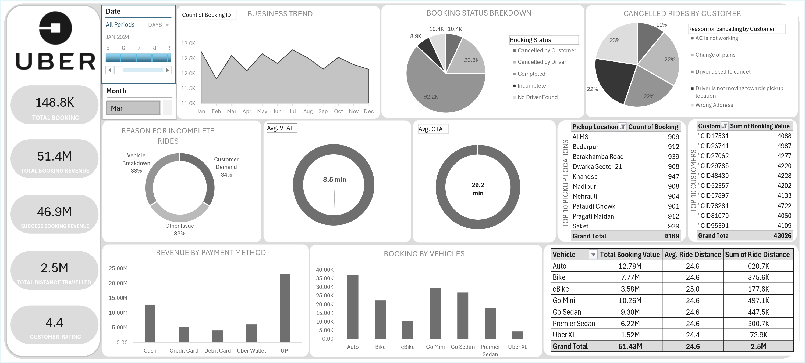

# 📊 NCR Ride Bookings – Excel Dashboard Project

## 📂 Dataset
The dataset used in this project is uploaded in this repository.  

📌 [**Download Dataset (CSV)**](./ncr_ride_bookings-%20Row%20Data.csv)

---

## 🛠️ Data Cleaning & Preparation
Steps performed during preprocessing:

- 🗑️ Removed duplicate **Booking IDs**  
- 📆 Converted **Date-Time** columns into proper formats  
- 🔢 Corrected numeric formatting for revenue/wait time  
- ➕ Created derived columns: `Month`, `Day` using `TEXT()` function  
- 📋 Structured into **Excel Table** for smooth analysis  

---

## 📊 Analysis & Modeling
Pivot Tables + Excel formulas used to create insights:

- 📈 **Business Trend Analysis** (Monthly & Weekly)  
- ❌ **Cancelled Rides Breakdown** (Top reasons)  
- ⚠️ **Incomplete Rides** – operational issues  
- 🚖 **Vehicle Type Analysis** (Auto, Car, Bike)  
- 📍 **Top Pickup Locations**  
- 👤 **Top Customers by Revenue**  

---

## 🖼️ Dashboard Preview

---

## 🔑 Key Insights
- 💰 **Total Booking Revenue:** 51.4M  
- 🏢 **Company Realized Revenue:** 46.9M  
- ❌ **~55K rides cancelled** → ~5M revenue loss  
- ⏳ **Avg CTAT:** 29 mins → reduces driver utilization  
- 🚖 **Auto rides highest demand** → fleet expansion required  
- 📍 Identified **top 10 pickup hotspots**  
- 👤 Highlighted **loyal/high-value customers**  

---

## ✅ Recommendations
- 🚨 Reduce **cancellations** to prevent heavy revenue loss  
- ⏳ Optimize **CTAT** for better customer experience  
- 🚖 Increase **Auto fleet size** to meet demand  
- 📊 Align **vehicle supply with customer demand**  
- 🔍 Regular monitoring via dashboard for strategic growth  

---

## 📂 Project Files
- `ncr_ride_bookings-%20Row%20Data.csv` → Cleaned dataset  
- `Dashboard.jpg` → Dashboard preview  
- `NCR_Ride_Bookings_Dashboard.xlsx` → Full interactive dashboard  

📌 [**Google Drive Link – Project Files**](https://drive.google.com/drive/folders/1dFxBdA8L9BV5E_JJ4jI9UQcCfd23_dAU)

---

## 🚀 Tech Stack
- **Microsoft Excel** → Data Cleaning, Analysis, Dashboarding  
- **Pivot Tables & Charts** → Interactive visuals  
- **Excel Formulas** → Derived metrics & insights  

---
